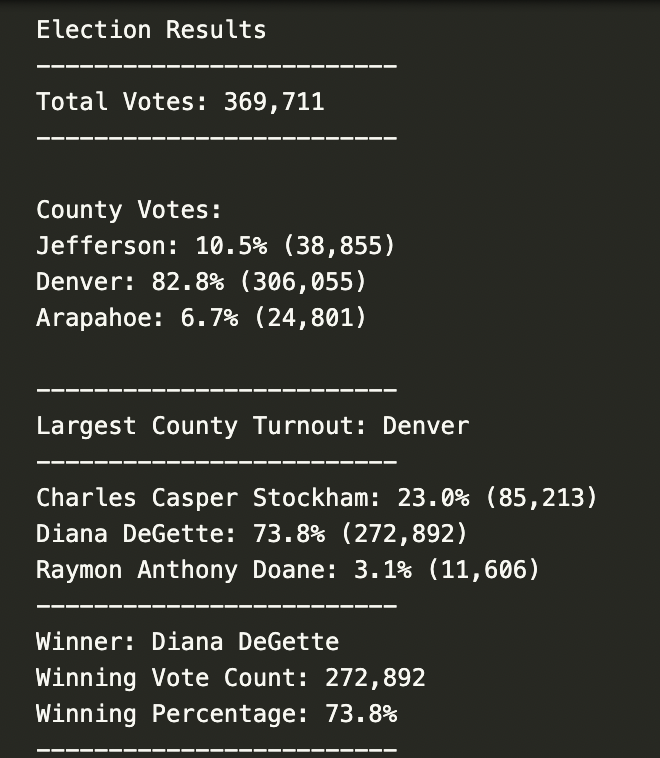

# Election_Analysis

## Overview of the Election Audit
A Colorado Board of Elections employee has given you the following tasks to complete the election audit of a recent local congressional election. 
  
  1. Calculate the total number of votes cast. 
  2. Compile a list of counties where votes were casted. 
  3. Calculate the number of votes casted in each county and the percentage of votes in each county. 
  4. Compile a list of the candidates.
  5. Calculate the total number of votes each candidate received.
  6. Calculate the percentage of votes each candidate won.
  7. Determine the winner of the election based on popular vote.
  
## Resources
  - Data Source: election_results.csv
  - Software: Python 3.7.6, Visual Studio Code 1.53.0

## Election Audit Results  
### Votes Cast

```
369,711
```

### Votes per County

  - Jefferson made up 10.5% of the total voter turnout with 38,855 votes casted.
  - Denver made up 82.8% of the total voter turnout with 306,055 votes casted.
  - Arapahoe made up 6.7% of the total voter turnout with 24,801 votes casted. 


### County with Largest Turnout

```
Denver 
```

### Candidates
```
   Charles Casper
   
   Diana DeGette
   
   Raymon Anthony Doane
```  
### Results

  - Carles Casper received 23.0% of the vote and 85,213 number of votes.
  - Diana DeGette received 73.8% of the vote and 272,892 number of votes.
  - Raymon Anthony Doane received 3.1% of the vote and 11,606 number of votes. 
 
### Winner

```
Diana DeGette
```



## Election Audit Summary
This script can be modified in order to accomodate elections where the type of vote is recorded in the dataset. In this situation, "vote_type" could have three different values: mail-in ballots, in-person punchcards, and direct recording electronic (DRE) counting. Collecting this information could be beneficial in understanding voter trends per county or state, such as if a type of voting method favors a particular candidate. If "voter_type" was part of the "election_results.csv" it would be necessary to modify the script by first creating a vote method list containing all three options, and then a voter method dictionary to hold a count of the number of times each voting method is used. Then it is necessary to loop through the data and add conditionals to find the number of times each voting method is used. 

If the "election_results.csv`" was based on a presidential election, the script would collect votes from counties and then convert the votes for winner of the popular vote to electoral votes. Since the Election Audit dataset was taken from a congressional election in Colorado, we can work with 9 electoral votes. After declaring a winner from the popular vote in Colorada, a conditional can be added the the if statement that declares the winner. Once the winner is declared, 9 electoral votes can be distrubuted to the candidate. 
